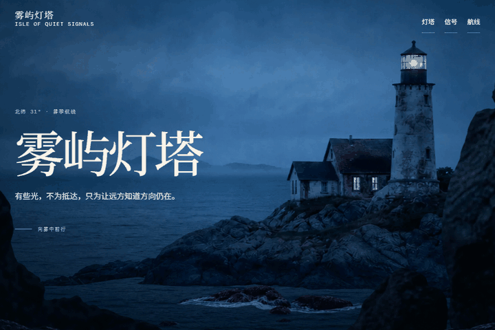
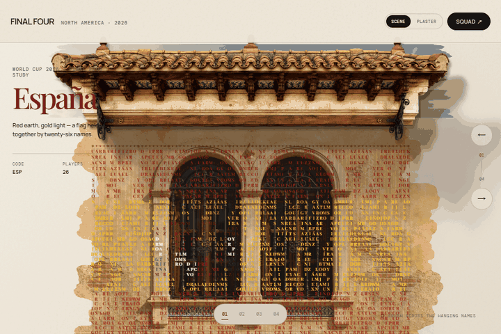
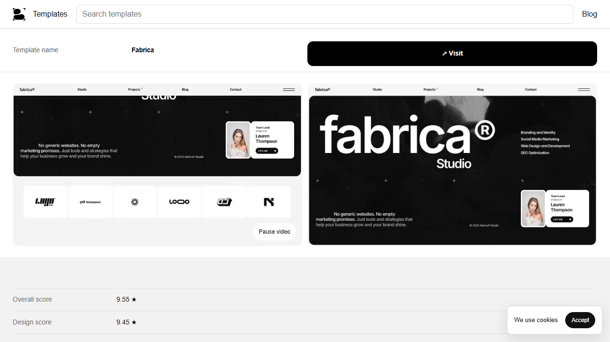
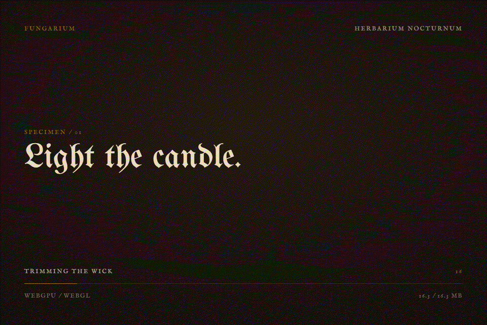
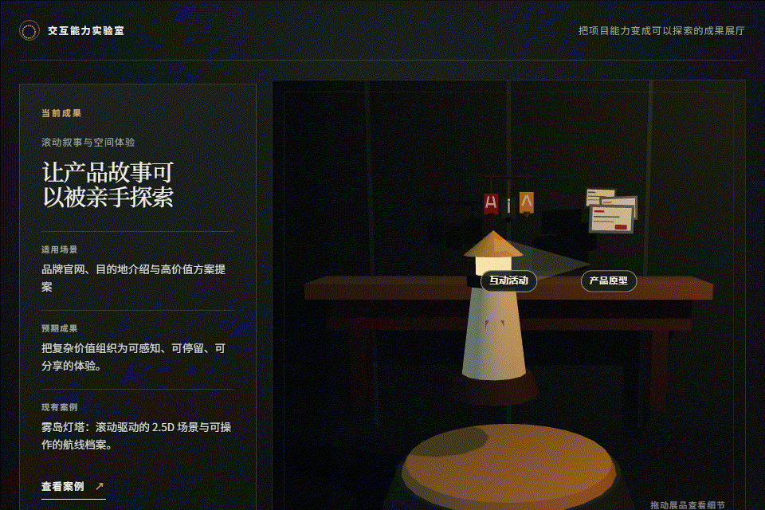
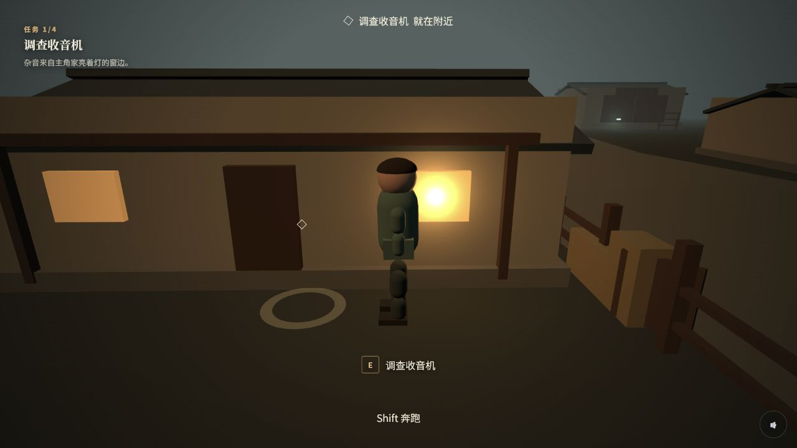
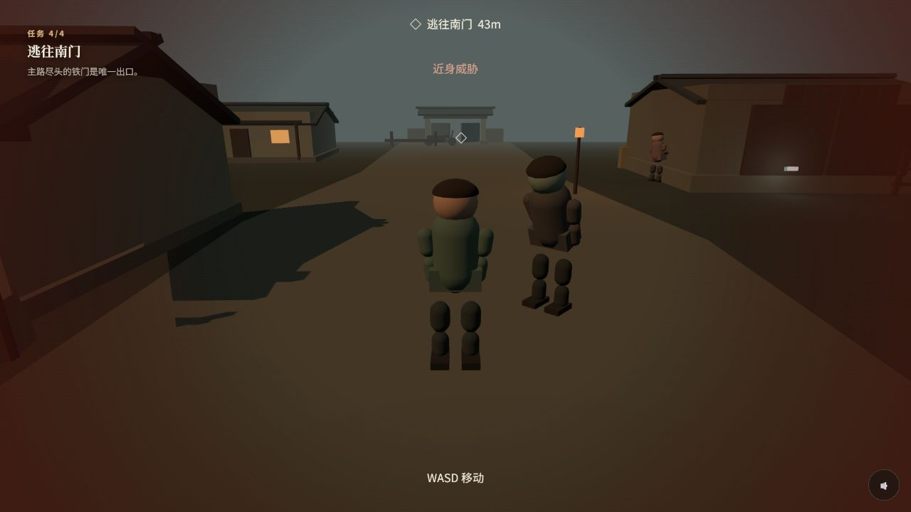
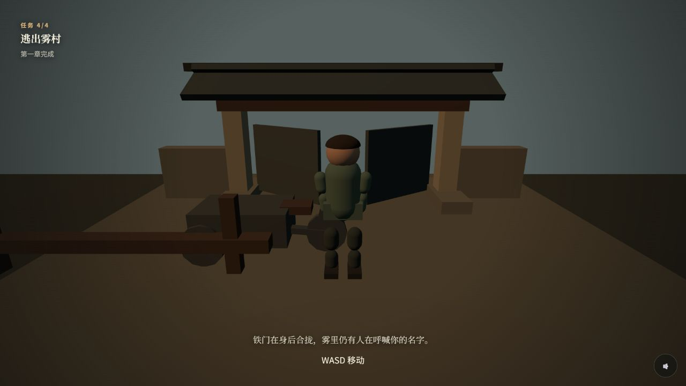

# 0728 Practical Skill Notebook

用于记录前端视觉、交互与创意编程探索的实践仓库。每个子目录都是可独立运行的案例；根 README 按可观看的演示单元组织。

## 演示目录

| 编号 | 演示 | 对应项目 | 说明 |
| --- | --- | --- | --- |
| 01 | [雾屿灯塔](./isle-of-quiet-signals/) | `isle-of-quiet-signals` | 原生滚动驱动的电影式 2.5D 灯塔场景。 |
| 02 | [雾中的信号](./isle-of-quiet-signals/) | `isle-of-quiet-signals` | 灯塔叙事中的悬挂文字帘；进入雾信号段后可被鼠标带动。 |
| 03 | [World Cup Letter Flags](./world-cup-letter-flags-demo/) | `world-cup-letter-flags-demo` | 由球员姓名拼成的国旗窗帘，字符沿 Verlet 物理线绳摆动。 |
| 04 | [Fabrica 模板详情页复刻](./fabrica-template-detail-clone/) | `fabrica-template-detail-clone` | 从线上模板详情页采集视觉、交互与素材证据后，以 React/Vite 本地重建的网页复刻案例。 |
| 05 | [Fungarium 原版与业务展厅改造](./fungarium-product-showcase/) | `fungarium-product-showcase` | 对照上游标本展厅交互与本仓库的中文业务能力展厅。 |
| 06 | [《雾村：逃离》](./rural-mutation-escape/) | `rural-mutation-escape` | 第三人称农村变异逃生原型与 AI 辅助游戏开发研究。 |
| 07 | [MengTo Skills 三产品能力展](./mengto-skills-showcase/) | `mengto-skills-showcase` | 用固定、可审计的 MengTo Skills 工作流，完成 3D 资产审阅、等距动作游戏与复杂商品配置三款独立产品，并由统一中文展厅串联体验与验证。 |
| 08 | [Finesse Skill 产品研究](./finesse-skill-product-research/) | `finesse-skill-product-research` | 文档与研究计划：梳理 Finesse 能力、受控验证方法与产品机会；交互研究展厅仍在计划中，当前不可运行。 |
| 09 | [My Room in 3D 空间化产品承载研究](./my-room-in-3d-research/) | `my-room-in-3d-research` | 研究 Bruno Simon 的 3D 房间作品集如何将空间、内容入口与动态媒体组合为可探索的个人/产品展示形态。 |

## 01 · 雾屿灯塔

滚动会推动海雾、前景、灯塔与叙事文字进入不同层次；不是视频播放，而是页面真实滚动驱动的场景变化。



## 02 · 雾中的信号

在灯塔的“雾中的信号”段落，文字被排成一层悬挂的信号帘。它使用 Canvas、约束链和轻量指针冲量模拟：鼠标划过时，局部字符会被带动并自然回落。小屏与“减少动态效果”偏好会自动省略此装饰层。


## 03 · World Cup Letter Flags

一项独立的创意编程案例：西班牙、英格兰、法国和阿根廷的旗帘由完整球员名单的字母构成。移动鼠标或拖动即可让局部姓名线绳产生摆动。



## 04 · Fabrica 模板详情页复刻

一个网页效果研究与复刻案例：先在桌面和手机端采集源页的布局、卡片网格、字体、媒体、页脚和可交互状态，再使用本地素材与组件化 React 页面重新实现。复刻重点不只是首屏，而是三列棋盘式推荐区、博客区、长页面节奏与响应式弹层。



复刻过程、目录说明、验证方式与素材边界见：[Fabrica 项目 README](./fabrica-template-detail-clone/README.md) 与 [视觉复刻记录](./docs/interactive-refinement/fabrica-visual-refinement.md)。

## 05 · Fungarium 原版与业务展厅改造

这一项记录一次“原版交互语言 → 业务展示应用”的独立探索：上游 Fungarium 用 3D 标本、观察视角与信息卡片组织内容；本仓库则把同类展示思路改造成中文能力展厅，让访客在沉浸式叙事、互动活动和产品原型之间切换，并直接进入已有案例。

原版效果（标本切换与观察视角）：



本仓库的业务展厅改造（能力选择与案例视角）：



上游参考：[nesdesignco/fungarium](https://github.com/nesdesignco/fungarium)，固定提交 [`a139bd08fc64cf0be76bd1dae447da6848d89899`](https://github.com/nesdesignco/fungarium/tree/a139bd08fc64cf0be76bd1dae447da6848d89899)。上游作品及其权利归原作者所有，并适用其 MIT 许可；本仓库未复制上游源码或第三方 GLB/PBR 素材。本项目只借鉴其交互展示思路，属于独立探索，不存在官方关联。

## 06 · 《雾村：逃离》

这一项目研究一款农村变异逃生游戏从零到可玩的开发逻辑：用数据定义村庄地图和任务锚点，以程序化 Three.js 构建建筑、道路、拟人角色和变异体，再接入共享碰撞、第一/第三人称镜头、线性故事引导、追逐危险反馈与原创动态音乐。

当前版本是可运行的序章原型：玩家可调查收音机、找到躲藏的邻居、取得手电并抵达南门；失败、检查点、感知 AI 和动态开门仍属于已确认但未落地的核心闭环计划。项目从 `mshumer/Claude-of-Duty` 研究工程方法，但没有复制其 FPS 玩法、源码或商业素材。

以下是从当前合并版本重新采集的三个确定性浏览器证据场景，不是一段无剪辑连续通关。

收音机交互与任务引导：



追逐与近身威胁；展示距离状态机，不代表攻击或捕获 AI：



静态南门出口触发区的序章完成状态；不展示动态开门、门碰撞或门外结算线：



当前 v0.1 已完成阶段性闭环。后续如恢复研究，建议按“补齐游戏闭环 → 提升美术体感 → 沉淀大模型生成流程”推进；三项目前均暂缓实施，不属于当前版本能力。详见[项目 README 的后续演进建议](./rural-mutation-escape/README.md#后续演进建议暂缓实施)。

- [项目 README：功能、操作、架构与限制](./rural-mutation-escape/README.md)
- [参考来源与独立实现边界](./rural-mutation-escape/docs/REFERENCES.md)

本地运行：

```powershell
cd rural-mutation-escape
npm.cmd install
npm.cmd run dev
```

验证：

```powershell
npm.cmd run test:unit
npm.cmd run test:audio
npm.cmd test
npm.cmd run build
```

## 07 · MengTo Skills 三产品能力展

这是一个统一中文 Showcase Hub 加三款独立 Three.js 产品的能力展：Monster Forge 审阅怪物资产，Ashfall Arena 展示可玩的动作游戏系统，Mech Atelier 配置复杂 3D 商品。仓库中有四个可运行应用、三款产品；Hub 是解释和导航入口，不是独立的第四个产品。


- **Monster Forge：** 检查模型、动作、骨架、碰撞体、插槽和来源。
- **Ashfall Arena：** 体验等距移动、战斗、敌人 AI、成长、存档与音画反馈。
- **Mech Atelier：** 更换机甲部件，观察兼容性、价格、重量、性能和分享状态。

方法与工作流参考 [MengTo Skills](https://github.com/MengTo/Skills)，本项目实际审查和安装的版本固定为 [`93da48f13fb1b91bdbf4718d0f49df1a469edb45`](https://github.com/MengTo/Skills/tree/93da48f13fb1b91bdbf4718d0f49df1a469edb45)。[Vesperfall](https://vesperfall.mengto.chatgpt.site/) 仅作为关联效果参考。

Vesperfall 仅作为关联效果参考。本项目没有复制或重新托管其源码、模型、贴图、动画或页面素材，也不存在官方关联。

Skill 指导 Codex 如何规划、实现、测试和交付；浏览器运行时不会加载 Skill，最终产物仍是普通的 Vite/Three.js 网页。

```powershell
cd mengto-skills-showcase
npm install
npm run dev
```

四个本地应用就绪后打开 `http://127.0.0.1:4172/`。组合生产构建使用 `npm run build:showcase`；当前未公开部署，没有线上产品地址。

- [完整项目说明](./mengto-skills-showcase/README.md)
- [套件验证账本](./mengto-skills-showcase/docs/SHOWCASE-VALIDATION.md)

## 08 · Finesse Skill 产品研究

这是一个面向 Finesse 的中文研究入口，而非当前可运行的演示。它以固定上游提交为范围，先在[能力地图](./finesse-skill-product-research/docs/CAPABILITY-MAP.md)中梳理 register 路由、SOUL / SPECTACLE / DENSITY、三条设计路线、设计模型与质量门禁的已知机制及边界；再用[受控研究计划](./finesse-skill-product-research/docs/RESEARCH-PLAN.md)规定 B1–B5、A/B/C 对照、证据记录和停止规则。

[产品机会方向](./finesse-skill-product-research/docs/PRODUCT-DIRECTIONS.md)提出六个待验证方向：Design Brief Router、AI Design Review Console、Design Model Studio、Multi-Register Prototype Lab、Pattern Knowledge Base 与 Team Governance Layer。推荐主线是“设计决策与审计工作台”：将输入路由、生成前约束与分层证据审计连接成可追溯闭环；这只是研究排序，不是已上线产品。

当前交付为文档。未来的[研究展厅计划](./finesse-skill-product-research/docs/SHOWCASE-PLAN.md)定义了能力总览、决策实验室、三路线对照、审计台和机会地图，但没有展厅代码、交互、数据接入、截图、部署、性能结果或验证结论，因而不能运行或作为功能证明。

## 09 · My Room in 3D 空间化产品承载研究

这是对 [brunosimon/my-room-in-3d](https://github.com/brunosimon/my-room-in-3d) 的源码与体验研究。上游作品把个人作品集组织成一个可自由观察的 3D 房间：模型、灯光、动态屏幕和局部特效共同构成空间化的内容入口。

对我们的意义不在于复刻一间房，而在于提炼“**3D 场景作为品牌入口与内容导航，常规页面承载高效阅读和转化**”的产品模式。它适合个人作品集、创意工作室、互动展厅与叙事型产品介绍；不适合作为信息检索、表单填写或高频交易流程的唯一界面。

子项目以固定上游提交 [`5d00b3f`](https://github.com/brunosimon/my-room-in-3d/tree/5d00b3f870da81f103e901e0d12e20bbcc816834) 保存为研究参考；技术结论、产品化缺口和后续可复用架构见 [研究笔记](./docs/research/my-room-in-3d.md)。上游源码、模型和媒体资产的权利归原作者及各自权利人所有；本仓库不将它们表述为自研资产，也不以本研究作为再发布或商用授权依据。

## 获取项目库代码

```powershell
git clone https://github.com/yydshly/0728_practical-skill-notebook.git
cd 0728_practical-skill-notebook
```

项目库按案例拆分；进入对应目录后安装依赖并启动即可。Fabrica 案例位于 `fabrica-template-detail-clone/`。

## 本地运行

### 灯塔项目

```powershell
cd isle-of-quiet-signals
npm install
npm run dev
```

测试与构建：

```powershell
npm test
npm run test:browser
npm run build
```

### World Cup 字母窗帘

```powershell
cd world-cup-letter-flags-demo
npm install
npm run dev
```

构建：

```powershell
npm run build
```

### Fabrica 模板详情页复刻

```powershell
cd fabrica-template-detail-clone
npm install
npm run dev
```

验证：

```powershell
npm run test -- --run
npm run build
npm run test:e2e
```

### Fungarium 原版与业务展厅改造

```powershell
cd fungarium-product-showcase
npm install
npm run dev
npm test
npm run build
npm run test:browser
npm run verify
cd ..
node scripts/record-fungarium-demos.mjs
node scripts/check-fungarium-fifth-project.mjs
```

## 相关文档

- [灯塔项目 README](./isle-of-quiet-signals/README.md)
- [灯塔素材清单](./isle-of-quiet-signals/docs/ASSETS.md)
- [灯塔时间轴设计](./isle-of-quiet-signals/docs/TIMELINE.md)
- [灯塔验证报告](./isle-of-quiet-signals/docs/VALIDATION.md)
- [World Cup 项目 README](./world-cup-letter-flags-demo/README.md)
- [Fabrica 项目 README](./fabrica-template-detail-clone/README.md)
- [Fabrica 视觉复刻记录](./docs/interactive-refinement/fabrica-visual-refinement.md)
- [《雾村：逃离》项目 README](./rural-mutation-escape/README.md)
- [《雾村：逃离》参考来源说明](./rural-mutation-escape/docs/REFERENCES.md)
- [完整项目说明](./mengto-skills-showcase/README.md)
- [套件验证账本](./mengto-skills-showcase/docs/SHOWCASE-VALIDATION.md)
- [Finesse Skill 产品研究：项目说明](./finesse-skill-product-research/README.md)
- [Finesse Skill 产品研究：能力地图](./finesse-skill-product-research/docs/CAPABILITY-MAP.md)
- [Finesse Skill 产品研究：受控研究计划](./finesse-skill-product-research/docs/RESEARCH-PLAN.md)
- [Finesse Skill 产品研究：产品机会方向](./finesse-skill-product-research/docs/PRODUCT-DIRECTIONS.md)
- [Finesse Skill 产品研究：未来研究展厅计划](./finesse-skill-product-research/docs/SHOWCASE-PLAN.md)
