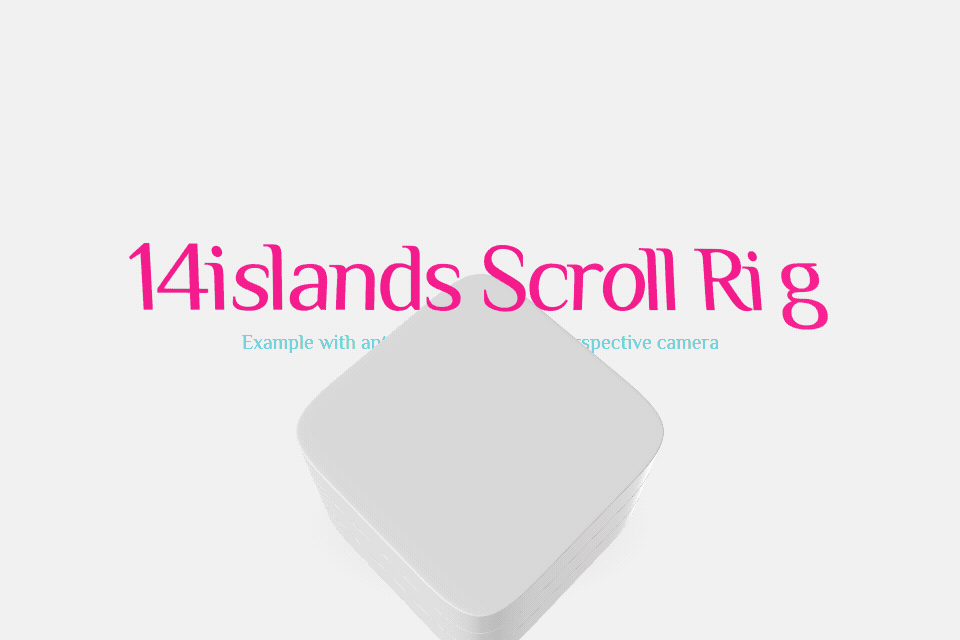
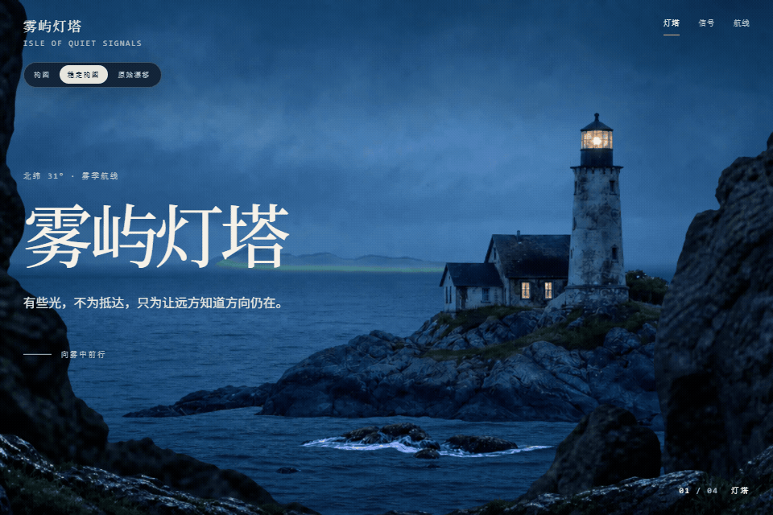

# r3f-scroll-rig 雾屿灯塔应用验证

这是一个独立的 Vite/React/R3F 样例，用来归纳 `@14islands/r3f-scroll-rig` 在网页叙事中的使用边界。它将 DOM 内容和 WebGL 场景同步，使用滚动驱动状态，并展示固定内容与视差层次。默认的“稳定构图”适合阅读节奏；在 `?composition=legacy` 路由中可查看“原始漂移”作为内置对照。

这类能力适用于滚动专题、产品故事和需要让网页信息与三维场景协同排布的落地页。它不是将图片自动转换为 3D 的服务或模型生成器。

## 两个演示分别证明什么？

原库 Demo 回答“这个库能做什么”：



灯塔 Demo 回答“我们如何把它用于真实场景”：



## 本地运行

```powershell
cd r3f-scroll-rig-showcase
npm ci
npm run dev
npm test
npm run build
```

开发服务器默认运行在 `http://127.0.0.1:4174/`；添加 `?composition=legacy` 可进入“原始漂移”对照模式。

## 依赖与研究边界

- 当前应用依赖 `@14islands/r3f-scroll-rig 8.15.0`。
- 上游仓库是 <https://github.com/14islands/r3f-scroll-rig>。
- 历史研究固定在提交 `adf7d47ea5bf3d8e8cf957b0f3667bea752e5f63`，仓库元数据版本为 `7.0.7`，历史样例实际安装 `6.0.5`。
- 上游采用 ISC 许可；本项目是独立实现与应用验证，不复制或托管上游源码，也不表示与上游存在官方关联。
