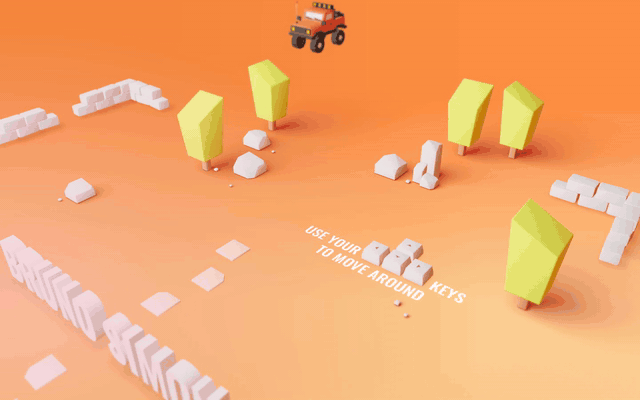
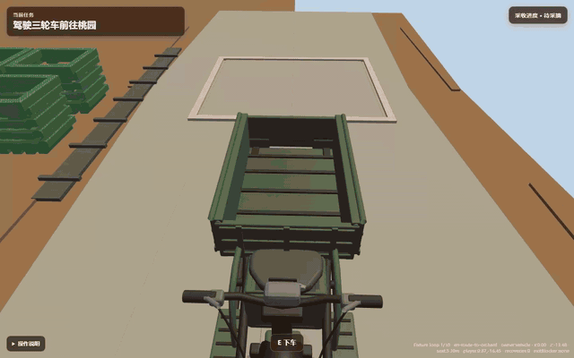

# Rural Peach Orchard

这是一个可游玩的农村桃园业务原型：玩家从农家院接受任务，驾驶电动三轮车沿道路进入桃园，停车下车后完成采摘、入筐、装箱、装车、返程和交付。目标不是做一个只有 3D 展示的页面，而是验证“真实场景资产 + 可驾驶空间 + 业务状态机 + 游戏化反馈”能否组成完整体验。

> 项目状态：本轮研究原型已经完成验证，现暂停继续开发并进入临时归档状态。人物美术、完整动作集、最终农村环境资产和车辆手感精修留待下一阶段。

## 演示录像

### 原始 Folio 2019 参考效果

[](docs/media/folio-2019-original-demo.webm)

7 秒核心片段，直接展示小车、环境资产、驾驶引导和场景移动。[打开高清 WebM 录像](docs/media/folio-2019-original-demo.webm)。

### 农村桃园业务原型

[](docs/media/rural-peach-orchard-core-loop.webm)

约 17 秒连续展示驾驶前往桃园、采摘装载、返程和交付完成；录像已经移除加载等待与测试状态闪屏。[打开高清 WebM 录像](docs/media/rural-peach-orchard-core-loop.webm)。

## 运行整体场景

```powershell
npm run dev -- --host 127.0.0.1 --port 4173
```

打开 `http://127.0.0.1:4173/feasibility`。默认场景不显示碰撞体、传感器或技术遥测；需要排查空间绑定时使用 `/feasibility?debug`。

操作方式：

- `W / S`：步行前后移动；驾驶时前进 / 倒车
- `A / D`：步行左右移动；驾驶时转向
- `Space`：车辆制动
- `E`：接受任务、上下车以及执行当前空间中的业务交互
- `R`：显式恢复到最近安全点

完整业务链路为：接受任务 → 驾车去桃园 → 停车下车 → 采摘 → 放入果筐 → 装箱 → 装车 → 驾车返回 → 交付。

## 我们真正验证的能力

这个项目最值得研究的不是“小车模型如何移动”，而是如何把视觉、空间和业务拆成可以分别生产、验证和替换的层。

| 层 | 负责什么 | 本项目中的实现 |
| --- | --- | --- |
| 场景资产 | 决定玩家看见什么 | 农房、院落、道路、桃园入口、果筐、周转箱、远景和桃树 GLB |
| 世界定义 | 决定内容放在哪里 | 80 × 60 米平面、30 棵树、路线、出生点、安全点和稳定语义锚点 |
| 碰撞与感应 | 决定哪里能走、何时可交互 | 不可见的 Rapier 地面、墙体/树干代理和六个业务传感器 |
| 控制与事件 | 决定玩家和车辆如何响应 | 步行、三轮车物理、上下车控制权转移、上下文 `E` 交互 |
| 业务状态 | 决定任务是否正确推进 | `HarvestDomain` 维护水果归属和九阶段采收流程 |
| 表现与反馈 | 把业务状态变成可理解体验 | 跟随相机、目标、交互提示、货物进度和场景中的空/满/已交付状态 |
| 证据与门槛 | 证明能力没有只停留在演示 | 十轮真实资产流程、失败关闭、状态可见性和渲染预算遥测 |

因此，模型和碰撞不是同一份数据。GLB 是玩家看到的视觉资产；简单盒体、圆柱和胶囊只作为隐藏的运行时代理。传感器也不是模型，而是把“玩家已到停车区”“人物靠近可采桃树”“车辆进入交付区”等空间事实转换为业务事件的边界。业务状态始终由领域模型持有，场景只根据状态切换可见内容，不再维护第二套流程。

## 场景与资产是如何来的

当前整体场景使用两个仓库自有的关键环境资产：

- `environment.orchard-world-overall-v1`：农房院落、道路、果园边界、停车区、工作道具、八个周转箱和非行走远景。
- `environment.peach-tree-overall-v1`：三种桃树变体，在运行时按世界定义实例化为 30 棵树。

资产源文件保留在 `resources/blender/environment`，构建脚本位于 `tools/blender`。它们不是运行时用基础图形拼出的临时代用品；可见建筑、道路、树木、箱筐、围墙、门和道具都来自导入的 GLB。

推荐的资产生产顺序是：

1. 先根据业务流程确定地图尺度、路线、停靠区、交互位置和镜头视线，不先追求模型细节。
2. 在 Blender 中按统一米制坐标制作可见资产，并用稳定节点名保留停车、果筐、装箱和交付锚点。
3. 保存可继续编辑的 `.blend`，导出 GLB，同时生成三角面、材质、节点和尺寸指标。
4. 在资产清单中登记 ID、许可、节点契约、实例上限和预算；两个环境 GLB 都是关键资产，缺失时直接显示具体资产 ID，不降级成方块场景。
5. 让世界定义同时驱动视觉摆放、隐藏碰撞、传感器、路线和恢复点，避免美术场景与业务空间各维护一套坐标。
6. 通过 Blender 回归、资产校验、单元测试、十轮浏览器流程和渲染预算共同验收，而不是只看一张效果图。

这套管线解决的是“如何稳定地产生并接入 3D 资产”：生成模型只是其中一步，节点语义、尺度、原点、许可、性能和业务锚点都属于资产交付契约。

## 可以扩展的业务场景

现有能力可以直接迁移到多种“空间作业 + 载具物流 + 状态交付”场景：

- 苹果、梨、柑橘等果园采收，只需替换植物、果实、容器和流程参数。
- 葡萄园、茶园、温室或设施农业巡检，改造行间路线和作业传感器即可。
- 农资配送、冷链装卸、仓储拣选、园区巡检等短途物流培训。
- 农业设备产品演示、客户方案讲解和沉浸式业务售前。
- 在当前流程上增加计时、评分、损耗、车辆电量、订单优先级和多批次任务，形成更完整的游戏化经营体验。

当前结构也支持把“一个桃园任务”扩展成数据驱动关卡：不同世界定义选择不同 GLB、路线、传感器布局和领域规则，而控制器、相机、车辆和证据框架可以复用。

## 扩展自己的项目

扩展时按以下边界推进，可以避免重新耦合成一个难以维护的大场景：

1. 在世界定义中增加稳定 ID、摆放、路线和语义锚点。
2. 在 Blender 资产中制作对应的可见节点，并更新资产清单、许可与预算指标。
3. 在课程层增加隐藏碰撞和传感器，但不把业务判断写进碰撞代码。
4. 在领域层增加命令、状态和所有权转移，再由上下文解析器把空间条件映射成可执行动作。
5. 由 HUD 和世界表现层读取领域快照，显示目标、提示和资产状态，不复制业务状态机。
6. 为新增链路补齐确定性夹具、失败关闭测试、真实键盘走查和留存截图。

## 当前边界

当前人物 `character.farmer-a-base` 是已批准的基础人模，仅用于验证步行、胶囊碰撞、上下车和业务交互；服装、外观和动画精修被有意延期，不应阻塞整体场景和完整业务体验。扩展村庄、室内、天气、交通、NPC 和开放世界流式加载同样不在这一研究切片内。

## 验证命令

```powershell
npm run test:unit
npm run test:e2e -- tests/e2e/feasibility.spec.ts
npm run feasibility:report
npm run assets:validate
npm run build
```

浏览器夹具地址为 `/feasibility?fixture=full-loop`。它通过与键盘玩法相同的控制、控制权和交互接口连续完成十轮流程，不在循环中直接派发领域状态，也不使用隐藏传送、恢复或替代资产。Playwright 将原始数据写入 `artifacts/feasibility/raw-e2e.json`，报告命令再生成失败关闭的 `artifacts/feasibility/feasibility-report.json`。

自动报告会重新计算物理步长 p95，并校验完整阶段顺序、零替代资产、零恢复、零所有权/阶段违规、零控制台错误、环境资产身份、30 棵树、8 个箱体、车辆批次数、默认调试分离、最终交付可见状态，以及不超过 200 次绘制调用和 350,000 个可见三角面的路线视图预算。真实键盘操作和最终截图证据由独立浏览器验收收口。
