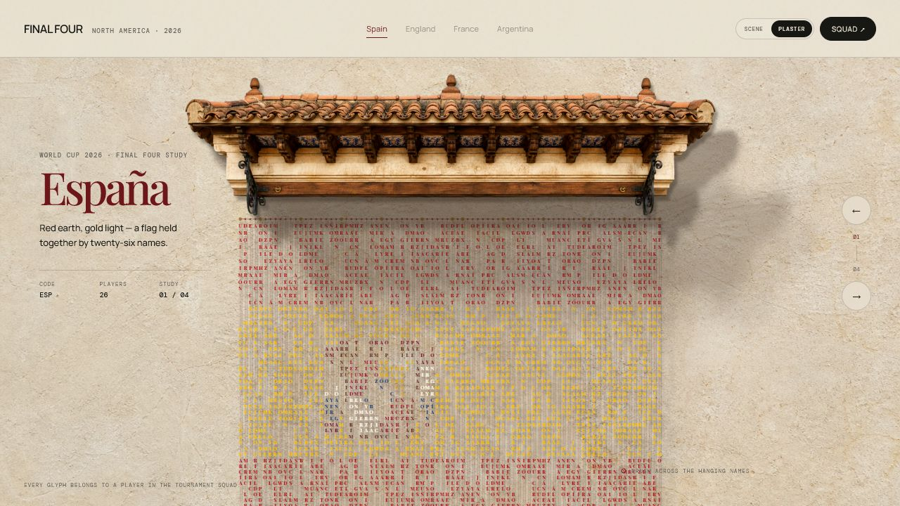

# Final Four — Typographic Flags

An interactive, open-source creative-coding study for the 2026 football World Cup final four: Spain, England, France and Argentina.

> Unofficial fan project. Not affiliated with or endorsed by FIFA, the tournament organizers, or any national football association.

<sub>Created by <a href="https://x.com/youraipulse">@youraipulse</a> and <a href="https://x.com/AmirMushich">@AmirMushich</a> · Inspired by <a href="https://x.com/marina_uiux">@marina_uiux</a></sub>



Each flag is rendered from the letters in the complete names of its 26-player tournament squad. The glyphs hang on individually simulated threads: brush through them with a pointer or finger and the impulse travels down the strand before settling under gravity.

## Run locally

Requirements: Node.js 22 or newer and npm.

```bash
npm install
npm run dev
```

Create a production build with:

```bash
npm run build
```

## Interaction

- Move or drag across the flag to catch the hanging name-threads and set them swinging.
- Use the country navigation, arrow buttons, or the left/right keyboard arrows.
- Open **Squad** to verify all 26 names used in the composition.
- Brush through at least two threads to trigger the team's commentary moment automatically; there is no separate sound switch.
- Reduced-motion preferences are respected.

## Commentary audio

The repository does not ship copyrighted broadcast recordings. FIFA's verified YouTube highlights were tested, but the rights holder disables playback on third-party embedded players. The app therefore uses four local drop-in slots tied to Spain v Belgium, Norway v England, France v Morocco and Argentina v Switzerland:

```text
public/audio/spain-opener-vs-belgium.mp3
public/audio/spain-qf-merino-88.mp3
public/audio/england-qf-bellingham-93.mp3
public/audio/england-equalizer-vs-norway.mp3
public/audio/england-semi-final-whistle.mp3
public/audio/france-qf-mbappe-60.mp3
public/audio/france-second-goal-vs-morocco.mp3
public/audio/france-semi-final-whistle.mp3
public/audio/argentina-qf-alvarez-112.mp3
public/audio/argentina-opener-vs-switzerland.mp3
public/audio/argentina-semi-final-clincher.mp3
```

When valid clips are installed, a meaningful brush gesture starts them automatically without a sound switch. Multiple clips for one country alternate on successive gestures. See [`public/audio/README.md`](./public/audio/README.md) for preparation and attribution guidance.

## Data snapshot

Squad data was checked on 13 July 2026 against official competition or national-association sources:

- [Spain — FIFA squad announcement](https://www.fifa.com/en/articles/spain-squad-announcement-luis-de-la-fuente)
- [England — England Football squad](https://www.englandfootball.com/articles/2026/May/22/england-mens-world-cup-2026-squad-named-by-thomas-tuchel-20262205), including Trevoh Chalobah replacing Tino Livramento
- [France — FIFA squad announcement](https://www.fifa.com/en/tournaments/mens/worldcup/canadamexicousa2026/articles/france-world-cup-squad-named)
- [Argentina — AFA final squad](https://www.afa.com.ar/seleccion/posts/lista-de-los-26-jugadores-de-la-seleccion-argentina-para-defender-el-titulo-en-la-copa-del-mundo-2026), with [Marcos Senesi replacing Leonardo Balerdi](https://www.fifa.com/es/tournaments/mens/worldcup/canadamexicousa2026/articles/leonardo-balerdi-baja-copa-mundial-argentina)

Player names and national colours are factual data. This project is unofficial and is not affiliated with FIFA or any national football association.

Flag geometry follows official national references: [Spain's constitutional red-yellow-red flag and coat of arms](https://www.lamoncloa.gob.es/espana/Paginas/constitucion.aspx), [England's Cross of St George](https://www.gov.uk/displaying-number-plates/flags-identifiers-and-stickers), [France's equal blue-white-red vertical bands](https://www.elysee.fr/la-presidence/le-drapeau-francais), and [Argentina's sky-blue/white triband with the Sun of May](https://www.argentina.gob.ar/pais/simbolos/bandera).

## Visual concept

The project is an original implementation inspired by kinetic typographic and cursor-reactive web experiments. Each country uses a generated, photorealistic architectural cutout with transparent edges:

- Spain — terracotta civic arcade with carved timber and azulejo details
- England — Victorian railway canopy in painted iron and ribbed glass
- France — Belle Époque marquise in patinated metal and amber glass
- Argentina — Buenos Aires zinc canopy with fileteado ironwork

The canopy, wall, sky and plaster images were created specifically for this project with OpenAI image generation, then extracted, manually reviewed and exported as optimized WebP assets. No official tournament branding, federation crests, player imagery or third-party visual assets are included.

## Project structure

```text
public/canopies/  Generated transparent architectural WebP assets
public/plaster/   Generated country-specific plaster textures
public/skies/     Generated atmospheric backgrounds
public/walls/     Generated architecture and edge-mask assets
src/canopies.js  Canopy asset map, alt text and preloading
src/data.js      Team rosters, source links and commentary moments
src/main.js      Verlet strand physics, canvas renderer, audio and interface state
styles.css       Editorial layout, responsive design and transitions
index.html       Accessible application shell
```

## License

Code and project-specific generated visual assets are released under the [MIT License](./LICENSE). Broadcast commentary clips are intentionally excluded; see the audio section above.

Contributions are welcome. Please read [CONTRIBUTING.md](./CONTRIBUTING.md) before opening a pull request.
